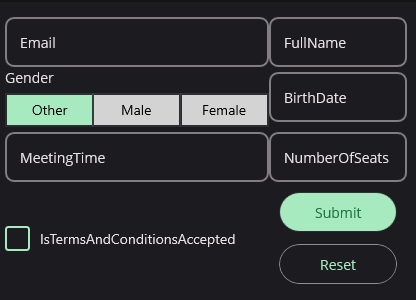
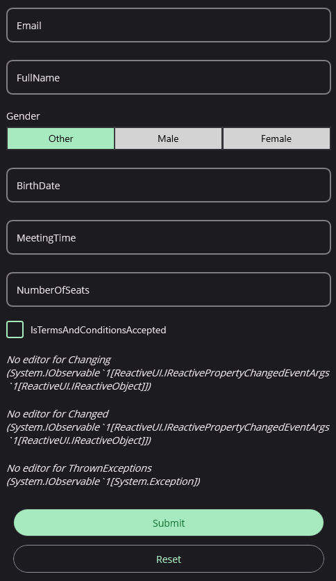

# AutoFormView

The `AutoFormView` is a view that automatically generates a form based on the properties of a model. It is a subclass of `FormView` and uses the same APIs.

## Usage

`AutoFormView` is defined in `UraniumUI.Controls` namespace. You can use it in XAML like this:

```xml
xmlns:uranium="http://schemas.enisn-projects.io/dotnet/maui/uraniumui"
```

Then you can use it like this:

```xml
<uranium:FormView Source="{Binding .}" />
```

### Example

```csharp
public class AutoFormViewPageViewModel : ViewModelBase
{
    [Reactive] public string Email { get; set; }
    [Reactive] public string FullName { get; set; }
    [Reactive] public Gender Gender { get; set; }
    [Reactive] public DateTime? BirthDate { get; set; }
    [Reactive] public TimeSpan? MeetingTime { get; set; }
    [Reactive] public int? NumberOfSeats { get; set; }
    [Reactive] public bool IsTermsAndConditionsAccepted { get; set; }
}
```

```xml
<uranium:AutoFormView Source="{Binding .}" />
```


## Configuration

AutoFormView can be configured using the `AutoFormViewOptions` in the MauiProgram.cs file. Here is an example of how to configure the `AutoFormView`:

```csharp
builder.Services.Configure<AutoFormViewOptions>(options =>
{
    // configure options here
});
```

### DataAnnotations
It's not supported DataAnnotations by default. You can add `UraniumUI.Validations.DataAnnotations` package to project and configure `AutoFormViewOptions` to use DataAnnotations.

```csharp
builder.Services.Configure<AutoFormViewOptions>(options =>
{
    options.ValidationFactory = DataAnnotationValidation.CreateValidations;
});
```

### EditorMapping
You can configure the `AutoFormView` to use a specific editor for a type. For example, you can configure the `AutoFormViewOptions` to use a `Editor` for `string` properties.

```csharp
builder.Services.Configure<AutoFormViewOptions>(options =>
{
    options.EditorMapping[typeof(string)] = (property, source) =>
    {
        var editor = new Entry();
        editor.SetBinding(Entry.TextProperty, new Binding(property.Name, source: source));
        return editor;
    };
});
```

> Note: The following types are already mapped by default: `string`, `int`, `float`, `double`, `DateTime`, `TimeSpan`, `bool`, `Enum`, `Keyboard`.


### Property Name Mapping
You can configure the `PropertyNameFactory` property of `AutoFormViewOptions` to use a custom factory to get the property name. For example, you can implement a localization factory to get the property name from a resource file.

```csharp
builder.Services.Configure<AutoFormViewOptions>(options =>
{
    options.PropertyNameFactory = property =>
    {
        return Localize(property.Name);
    };
});
```

## Customization

You can customize the `AutoFormView`.


## ItemsLayout
You can customize the `ItemsLayout` of the `AutoFormView` using the `ItemsLayout` property. For example, you can use a `GridLayout` to display the properties in a grid.

> **Note:** It's not the same as the `ItemsLayout` of the `CollectionView`. This is a **real** layout that will be used to place editors into children. Such as `StackLayout`, `Grid`, `FlexLayout`, etc.

```xml
<uranium:AutoFormView Source="{Binding .}">
    <uranium:AutoFormView.ItemsLayout>
        <uranium:GridLayout ColumnCount="2" RowCount="4" />
    </uranium:AutoFormView.ItemsLayout>
</uranium:AutoFormView>
```




## ShowMissingProperties

You can configure the `AutoFormView` to show missing properties using the `ShowMissingProperties` property. For example, you can set the `ShowMissingProperties` to `true` to show all properties of the model.

```xml
<uranium:AutoFormView Source="{Binding .}" ShowMissingProperties="True" />
```

